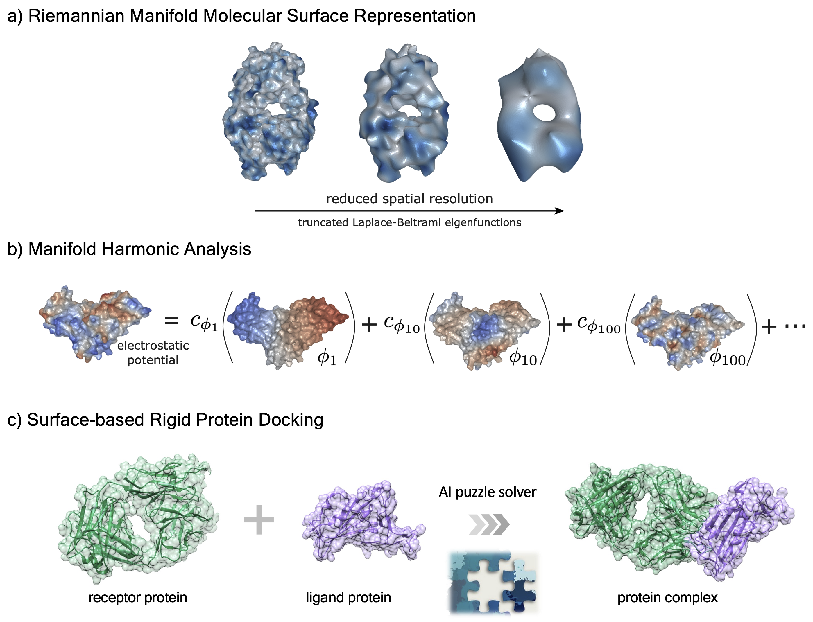

# Harmonic Molecular Representations (HMR)

Thanks for your interest in our ICLR 2023 paper "Learning Harmonic Molecular Representations on Riemannian Manifold" ([link](https://openreview.net/pdf?id=ySCL-NG_I3)).

Please refer to the [official repository](https://github.com/bytedance/HMR) for the code and data.





We will publish the source code shortly, thanks for your patience.


## Citation
```
@inproceedings{
    wang2023hmr,
    title={Learning Harmonic Molecular Representations on Riemannian Manifold},
    author={Yiqun Wang, Yuning Shen, Shi Chen, Lihao Wang, Fei Ye, and Hao Zhou},
    booktitle={International Conference on Learning Representations},
    year={2023},
    url={https://openreview.net/pdf?id=ySCL-NG_I3}
}
```
